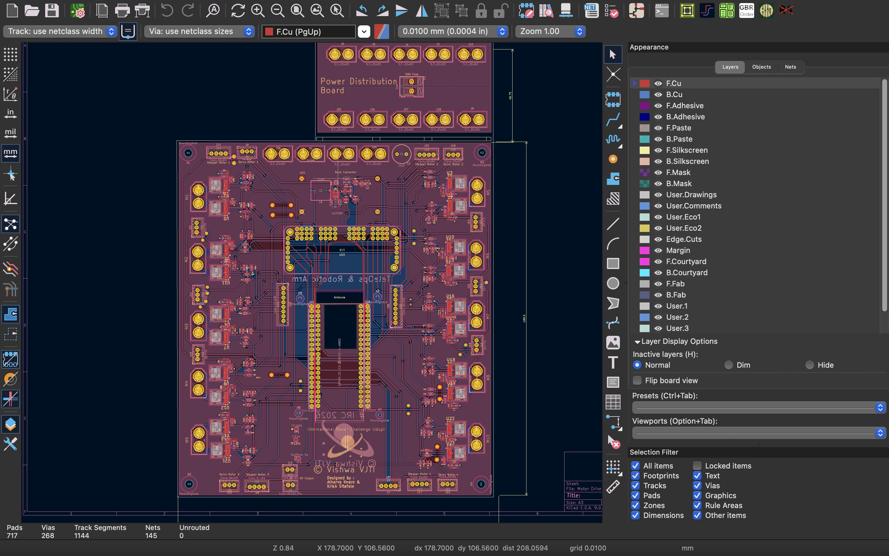
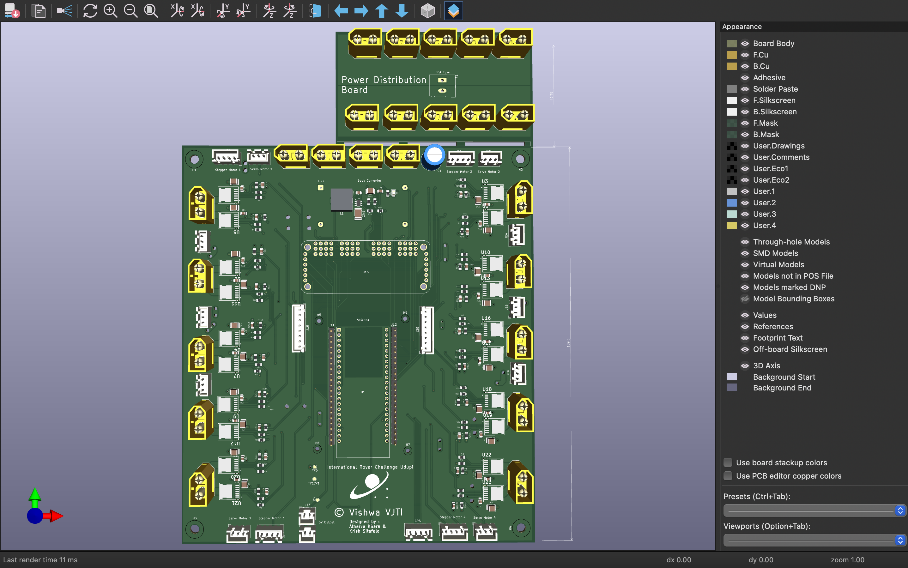

# TeleOps Motor Driver PCB
### International Rover Challenge (IRC) 2026 | Team Vishwa, VJTI

## Overview

The **TeleOps Motor Driver PCB** is a custom-designed embedded motor control board developed for **Team Vishwa, VJTI** for the **International Rover Challenge (IRC) 2026**.

The objective of this board was to consolidate multiple motor driver modules, PWM generators, power regulators, and peripheral interfaces into a single reliable PCB capable of controlling the rover's complete teleoperation subsystem.

Unlike conventional rover electronics that rely on several separate modules connected with extensive wiring, this PCB integrates all essential electronics into one compact system, improving reliability, reducing wiring complexity, and simplifying maintenance during competitions.

## Features

- ESP32-S3 based control unit
- Custom 5V Buck Converter (TPS54302)
- 10 High Current H-Bridge Drivers (BTN9970LV)
- PCA9685 16-Channel PWM Expander
- Encoder Interfaces
- GPS Interface
- Servo Motor Support
- Modular Connectors
- High Current PCB Layout
- Designed specifically for IRC Rover

## Hardware Specifications

| Component | Description |
|-----------|-------------|
| Microcontroller | ESP32-S3 |
| Buck Converter | TPS54302 |
| Motor Driver  | BTN9970LV |
| PWM Expansion | PCA9685 |
| Logic Voltage | 3.3V |
| Motor Supply  | 12V |
| PCB | 2 Layer |
| Communication | I²C, GPIO, PWM |

# System Architecture

                         12V Battery
                              │
                ┌─────────────┴─────────────┐
                │                           │
                │                    Motor Supply
                │                           │
                ▼                           ▼
      TPS54302 Buck Converter      10× BTN9970LV Drivers
                │
                ▼
             5V Rail
                │
                ▼
           ESP32-S3 MCU
                │
      ┌─────────┼─────────────────────────────┐
      │         │                             │
      │         │ I²C                         │ Native PWM
      │         ▼                             ▼
      │     PCA9685                    ESP32 PWM Outputs
      │   (16 Channel PWM)             (LEDC Peripheral)
      │         │                             │
      │         │                             ├──────── 2 DC Motor Drivers
      │         │                             │
      │         │                             └──────── 4 Servo Motors
      │         │
      │         ├──────── 8 Motor Driver PWM Inputs
      │         │
      │         └──────── Future Expansion
      │
      ├──────── Encoder Inputs
      │
      ├──────── GPS Interface
      │
      └──────── Programming Interface

## Motor Control Architecture

The rover requires control of multiple actuators with independent PWM channels. To efficiently utilize the ESP32's peripherals, the PWM generation is divided as follows:

| PWM Source | Devices Controlled |
|------------|--------------------|
| PCA9685(PWM Expander) | 8 High-Power DC Motor Drivers |
| ESP32 Native PWM      | 2 High-Power DC Motor Drivers |
| ESP32 Native PWM      | 4 Servo Motors                |

This hybrid architecture reduces the processing load on the ESP32 while providing highly stable PWM signals for the drivetrain and robotic arm.

## Supported Actuators

### Drive System

- 6 Planetary DC Motors

### Robotic Arm

- 3 Stepper Motors
- 1 Planetary DC Motor
- 2 Worm Gear Motors
- 4 Servo Motors

### Sensors

- OE775 Quadrature Encoders
- GPS Module

## PCB Highlights

- Dedicated power plane for motor supply
- Optimized ground routing
- High-current copper traces
- Decoupling for every IC
- Modular connector layout
- Compact footprint
- Easy debugging headers
- Competition-ready wiring

## Testing

The PCB has successfully passed the following validation tests.

- Power Supply Verification
- ESP32 Programming
- Buck Converter Efficiency Test
- PCA9685 Communication
- PWM Signal Verification
- Motor Driver Validation
- Encoder Testing
- Servo Testing
- Thermal Performance
- Complete System Integration

## Future Improvements

- Closed Loop Motor Control
- Current Monitoring
- Battery Voltage Monitoring
- CAN Bus Support
- IMU Integration
- OTA Firmware Updates
- ROS 2 Compatibility

## Gallery

## Acknowledgements

This PCB was designed and developed as part of the **Electronics Subsystem** of **Team Vishwa, VJTI** for the **International Rover Challenge (IRC) 2026**.

Special thanks to **Atharva Khare** for his invaluable guidance throughout the design, debugging, and testing phases of the project.

## Author

**Krish Sitafale**

Electronics & Telecommunication Engineering  
Veermata Jijabai Technological Institute (VJTI), Mumbai

Team Vishwa – IRC 2026

## License

This project is released for educational and research purposes.
